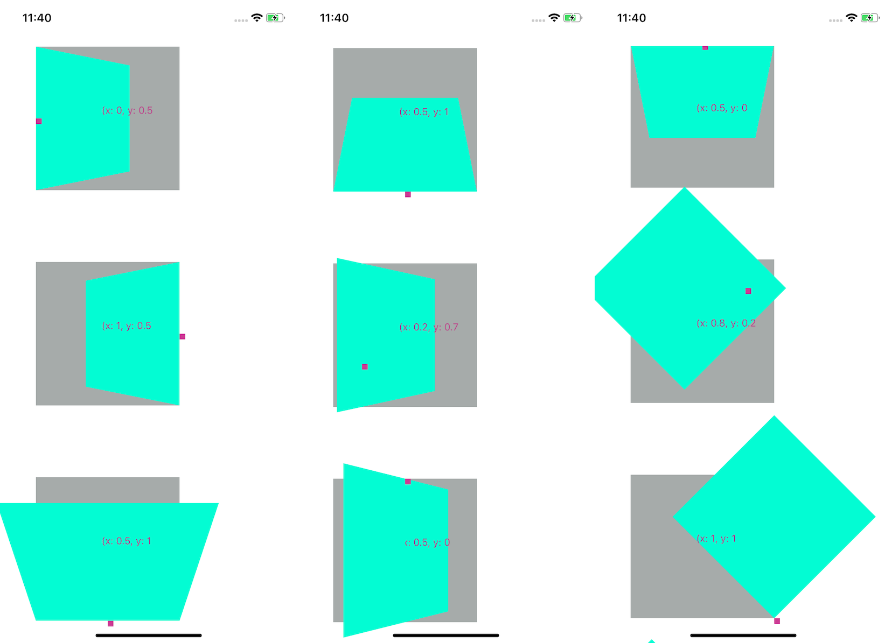

# react-native-anchor-point


Provide `withAnchorPoint` function to inject Anchor Point, or called Pivot Point into your transform object, to achieve 3D transform animation in React-Native. This is similar to web `transform-origin`. 

> Make the 3D transform easier in React Native




## Getting Started 

install the `react-native-anchor-point` 

```
yarn add react-native-anchor-point
```
or 
```
npm install react-native-anchor-point
```

## Example 

```javascript
import { withAnchorPoint } from 'react-native-anchor-point';

getTransform = () => {
    let transform = {
        transform: [{ perspective: 400 }, { rotateX: rotateValue }],
    };
    return withAnchorPoint(transform, { x: 0.5, y: 0 }, { width: CARD_WIDTH, height: CARD_HEIGHT });
};
    
<Animated.View style={[styles.blockBlue, this.getTransform()]} />
```